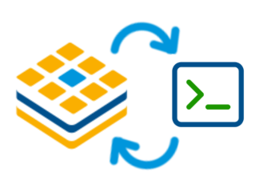

# Torizon Development Environment CLI (TCD)

<p align="center">
    
</p>

This document provides an overview of the `torizon-dev`, installation and its available commands and arguments.

> [!WARNING]
> This is an experimental feature, changes or issues may occur. Please report any issue or feedback to the Torizon IDE team.

## Installation

### Prerequisites

- Linux or WSL2 (Debian Bookworm or Ubuntu 24.04)
- Docker
- Docker Compose plugin v2
- wget

### Running

Run the follow on a bash terminal:

```bash
wget https://raw.githubusercontent.com/torizon/vscode-torizon-templates/refs/heads/dev/scripts/bash/tcd-env-setup.sh
```

This will download the script `tcd-env-setup.sh` to your current directory.
Source the script to your current shell:

```bash
source tcd-env-setup.sh
```

After sourcing, you can run the command `torizon-dev` to start using the Torizon Development Environment.

## Commands and Arguments

### General Arguments

| Argument       | Description                                      |
|----------------|--------------------------------------------------|
| `--version, -v`| Show the version of the Torizon Development Environment. |

### Commands

#### ▶️ `scan`

| Description                                      |
|--------------------------------------------------|
| The `scan` command is used to discover network devices on the local network. |

| Subcommand | Description                                      |
|------------|--------------------------------------------------|
| `list`     | Display the list of network devices found in the previous scan. |
| `connect`  | Connect to a network device listed in the scan. Requires `id` argument, provided by `scan list` |

#### ▶️ `connect`

| Description                                      |
|--------------------------------------------------|
| The `connect` command is used to connect a device previously discovered by the `scan` command. Running only  the `connect` command will behave like `scan connect`. |

| Subcommand | Description                                      |
|------------|--------------------------------------------------|
| `list`     | Show the list of connected devices.              |

#### ▶️ `target`

| Description                                      |
|--------------------------------------------------|
| The `target` command is used to set and manage a connected, with `scan connect` or `connect`, device. You need to first set a target device before using the other commands. |

| Subcommand          | Description                                      |
|---------------------|--------------------------------------------------|
| `get`               | Show the device set as the target.               |
| `set`               | Set the target device. Requires `id` argument.   |
| `console`           | Open a remote console to the target device.      |
| `reboot`            | Reboot the target device.                        |
| `shutdown`          | Shutdown the target device.                      |
| `list-builtin-dto`  | Show a list of available pre-built overlays for the target device. |
| `list-applied-dto`  | Show a list of overlays applied to the target device. |
| `apply-dto`         | Apply a list of device tree overlays to the target device. Requires `dto_list` argument. |

#### ▶️ `new`

| Description                                      |
|--------------------------------------------------|
| Create a new Torizon project |

| Subcommand | Description                                      |
|------------|--------------------------------------------------|
| `cli`      | Create a new Torizon project using the CLI. Requires `--template`, `--name`, `--container-name`, and `--path` arguments. |

#### ▶️ `init`

| Description                                      |
|--------------------------------------------------|
| Initialize the workspace to work with the target device. |

#### ▶️ `tasks`

| Description                                      |
|--------------------------------------------------|
| Show the list of tasks available on a workspace |

| Subcommand | Description                                      |
|------------|--------------------------------------------------|
| `list`     | Show the list of tasks available on the workspace. |
| `desc`     | Show the description of a given task. Requires `label` argument. |
| `run`      | Run a given task. Requires `label` argument.     |

> [!TIP]
> The `tasks` command is used to run tasks defined in the `tasks.json` file. The initiliazation of the workspace will read this file and will list the labels of the tasks available if the user type `tab` key after the `torizon-dev tasks run` command.

#### ▶️ `fetch`

| Description                                      |
|--------------------------------------------------|
| Fetch the latest version of the templates repo |

| Argument       | Description                                      |
|----------------|--------------------------------------------------|
| `--url, -u`    | The URL of the templates repository. Default: `https://github.com/torizon/vscode-torizon-templates.git`. |
| `--branch, -b` | The branch of the templates repository to fetch. Default: `dev`. |
| `--tag, -t`    | The tag of the templates repository to fetch. Default: `next`. |
